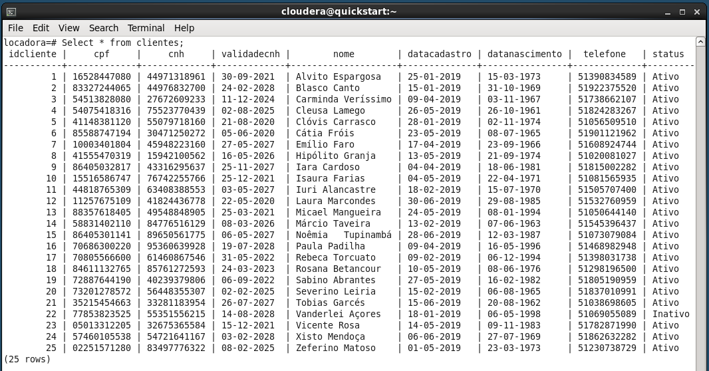

# Projeto Robocar

Este projeto foi recriado a partir das vídeo aulas apresentadas no curso ***Formação Engenheiro de Dados: Domine Big Data!*** disponível neste [link](https://www.udemy.com/share/101CKgBEYcdldTRHw=/) ministrado pelo professor Fernando Amaral.

O mini projeto será dividido em 4 etapas.

***1º - A locadora que controlar a locação de veículos.***

Para isso será criado um banco de dados no Postgres onde serão criadas as tabelas.

***2º - Ela deseja fornecer dados analíticos para os gestores.***

Iremos realizar a importação dos dados do banco de dados Postgres para o Hive onde iremos realizar algumas consultar usando o Hue.

***3º - Ter os contratos armazenados digitalmentes em algum banco de dados.***

Iremos simular um ambiente de armazenamento no MongoDB

***4º - Gerenciar diariamente o número de contratos de risco.***

E ao final será executado uma pequena aplicação para buscar contratos de risco.
________________________________________________________________________________________

# 1º Etapa, criação do banco de dados relacional e carga dos dados.

## Modelo relacional projetado


## Scripts - Criação das tabelas relacionas

```sql

/*Deleta o banco de dados caso ele exista.*/

drop database if exists locadora;

/*Cria o banco de dados*/

create database locadora;

-- Conecta no banco 

\c locadora;

-- Altera o datestyle do banco

set datestyle to PostgreSQL, Europena;

-- Dropa as tabelas caso exista

DROP TABLE IF EXISTS locacao;
DROP TABLE IF EXISTS clientes;
DROP TABLE IF EXISTS despachantes;
DROP TABLE IF EXISTS veiculos;

-- Cria as tabelas

create table if not exists clientes 
(
	idcliente integer not null,
	cpf character varying(11) not null,
	cnh character varying(11) not null,
	validadecnh date not null,
	nome character varying(15) not null,
	datacadastro date not null,
	datanascimento date not null,
	telefone character varying(11),
	status character varying(7) not null,
	constraint clientes_pkey primary key (idcliente)
);

create table if not exists despachantes 
(
	iddespachante integer not null,
	nome character varying(150) not null,
	status character varying(7) not null,
	filial character varying(15) not null,
	constraint despachantes_pkey primary key (iddespachante)
);

create table if not exists veiculos
(
	idveiculo integer not null,
	dataaquisicao date not null,
	ano integer not null,
	modelo character varying(150) not null,
	placa character varying (10) not null,
	status character varying(12) not null,
	diaria numeric(10,2) not null,
	constraint veiculos_pkey primary key (idveiculo)
);

create table if not exists locacao
(
	idlocacao integer not null,
	idcliente integer not null references clientes(idcliente),
	iddespachante integer not null references despachantes(iddespachante),
	idveiculo integer not null references veiculos(idveiculo),
	datalocacao date not null,
	dataentrega date,
	total numeric(10,2),
	constraint locacao_pkey primary key (idlocacao, idcliente, iddespachante)
);

```

### Executando a criação das tabelas


### Inserindo os dados 


### Consulta na tabela clientes



### Consulta na tabela despachantes


### Consulta na tabela veiculos


### Consulta na tabela Locacao


________________________________________________________________________________________

# 2º Etapa, importação dos dados para o Hive.

Nesta etapa, usando o beeline, foi feito uma conexão no banco do Hive da VM e criado um database para receber os dados que estão no Postgresql.


Após a criação do banco, utilizei o Sqoop para importar os dados.

``` 
sqoop import --connect jdbc:postgresql://127.0.0.1/locadora --username postgres --password 123456 --table clientes --hive-import --create-hive-table --hive-table locadora.clientes; 
```


```
sqoop import --connect jdbc:postgresql://127.0.0.1/locadora --username postgres --password 123456 --table despachantes --hive-import --create-hive-table --hive-table locadora.despachantes;
```


```
sqoop import --connect jdbc:postgresql://127.0.0.1/locadora --username postgres --password 123456 --table veiculos --hive-import --create-hive-table --hive-table locadora.veiculos;
```


```
sqoop import --connect jdbc:postgresql://127.0.0.1/locadora --username postgres --password 123456 --table locacao --hive-import --create-hive-table --hive-table locadora.locacao;
```


Realizando uma consulta simples no Hive para verificar se tabelas foram criadas com sucesso.


Para realizar a analise dos dados optei por utilizar a interface do HUE que é bastante amigável.

O projeto propôs para fins didáticos algumas análises que iremos realizar diretamente na interface do Hue, para tornar mais prático e reutilizável, foram criadas algumas views.


##### Quais despachantes locaram quais veiculos?


##### Quais veículos foram locados em determinados períodos?


##### Qual o faturamento mensal de locação?


##### Quais clientes locaram quais veículos?


________________________________________________________________________________________

# 3º Etapa, simulando arquivos de contrato e importando para o MongoDB

Nesta fase do projeto eu criei um pequeno script para gerar alguns dados de contrato ficticio no formato .json e importar para o Mongo DB.

```
from faker import Faker
import json		
from random import randint	
from datetime import datetime

fake = Faker()

def input_data(x):

    contract = {}
    
    for i in range(1, x + 1):
        contract[i]= {}
        contract[i]['idcliente'] = randint(1, 25)
        contract[i]['idcontrato'] = randint(1, 9999)
        contract[i]['datacadastro'] = fake.date()

        risk = randint(1, 3)

        if risk == 1:
            contract[i]['tiporisco'] = 'alto'
        elif risk == 2:
            contract[i]['tiporisco'] = 'moderado'
        else:
            contract[i]['tiporisco'] = 'baixo'

    print(contract)

	# dictionary dumped as json in a json file
    with open('contracts.json', 'w') as fp:
        json.dump(contract, fp)
	
def main():

	# Enter number of contracts
	number_of_contracts = 25
	input_data(number_of_contracts)

main()

```

O arquivo .json gerado está disponível [aqui](files/mongoDB/data.json)

Aqui eu apenas enviei o arquivo .json para a VM e executei o comando abaixo


Após isso somente conferir se a collection estava OK.


